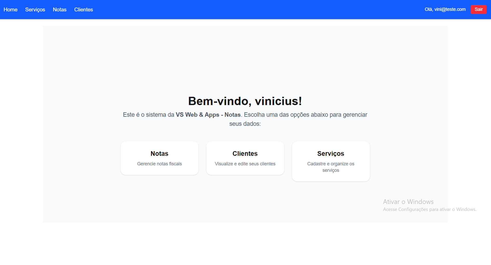
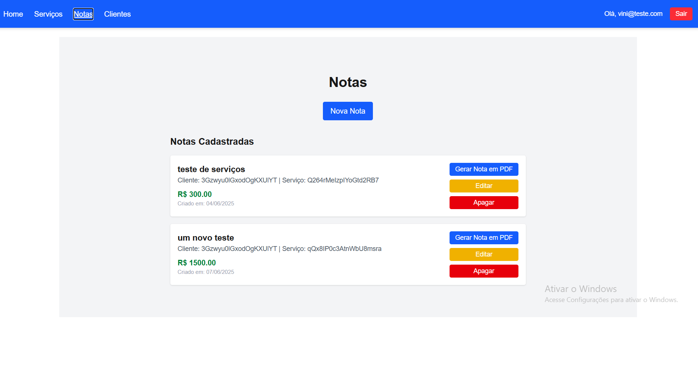

# VS Web Notas

Sistema web para gestão de serviços e emissão de notas, desenvolvido com **Next.js**, **Firebase** e **Tailwind CSS**. Ideal para freelancers, prestadores de serviços e pequenas empresas que desejam organizar seus atendimentos e gerar registros simples de notas.

## ✨ Funcionalidades

- Autenticação de usuários com Firebase Auth
- Cadastro de serviços com nome, descrição e valor
- Listagem e edição de serviços
- Modal para editar ou excluir serviços
- Acesso restrito para administradores
- Interface moderna, responsiva e intuitiva

## 🛠️ Tecnologias

- [Next.js 14 (App Router)](https://nextjs.org/)
- [TypeScript](https://www.typescriptlang.org/)
- [Tailwind CSS](https://tailwindcss.com/)
- [Firebase (Auth, Firestore)](https://firebase.google.com/)
- [Headless UI (Modal)](https://headlessui.com/)
- [Lucide Icons](https://lucide.dev/)

## 📸 Imagens do Projeto

| Página | Imagem |
|--------|--------|
| Home |  |

| Notas |  |

## 🚀 Como executar localmente

1. Clone o repositório:

```bash
git clone https://github.com/seu-usuario/vs-web-notas.git
cd vs-web-notas
npm install

```

## 🧑‍💼 Sobre
Esse projeto faz parte da suíte de soluções oferecidas por VS Web & Apps, voltadas para digitalização de negócios com sites e sistemas sob medida.

## 📄 Licença

Este projeto está licenciado sob a MIT License.